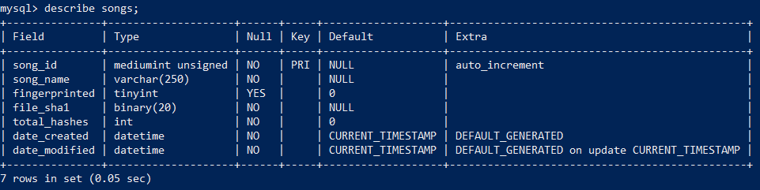

Audio fingerprinting and recognition algorithm implemented in Python
==========
A GUI application built using PyQt5 trying to make a Shazam clone. The work was inspired by following [An Industrial-Strength Audio Search Algorithm Paper](https://www.ee.columbia.edu/~dpwe/papers/Wang03-shazam.pdf) and [Dejavu Repositary.](https://github.com/worldveil/dejavu#readme)


The GUI can identify an audio by fingerprinting it and adding it to the database. Then by reading the song from disk or by mixing diffrent songs, It return the matched audio against the fingerprints held in the database.
**Configuring the database and fingerprinting songs from the GUI are on progress** 


##  How it works?
The "fingerprints" are **locality sensitive hashes** that are computed from the spectrogram of the audio. This is done by taking the FFT of the signal over overlapping windows of the song and identifying peaks. A very robust peak finding algorithm is needed, otherwise you'll have a terrible signal to noise ratio.

Here I've taken the spectrogram over the first few seconds of "Blurred Lines". The spectrogram is a 2D plot and shows amplitude as a function of time. Frequency, binned logrithmically, just as the human ear percieves it. In the plot below you can see where **local maxima** occur in the amplitude space:


Finding these local maxima is a combination of a high pass filter (a threshold in amplitude space) and some image processing techniques to find maxima. A concept of a "neighboorhood" is needed - a local maxima with only its directly adjacent pixels is a poor peak - one that will not survive the noise.

If we zoom in even closer, we can begin to imagine how to bin and discretize these peaks. Finding the peaks itself is the most computationally intensive part, but it's not the end. Peaks are combined using their discrete time and frequency bins to create a unique hash for that particular moment in the song - creating a fingerprint.


##  Installation 
You should Install These python packages.
- `ffmpeg` for converting audio files to .wav format.
- `pydub`, a Python ffmpeg wrapper.
- `numpy` for taking the FFT of audio signals.
- `scipy`, used in peak finding algorithms.
- `matplotlib`, used for spectrograms and plotting.
- `MySQLdb` for interfacing with MySQL databases.

Next, you'll need to create a MySQL database where you can store fingerprints. For example, on your local setup :
	
	$ mysql -u root -p
	Enter password: (Your Pass Here)
	mysql> CREATE DATABASE IF NOT EXISTS (Database Name);

## Fingerprinting

Make a folder and put in it all the songs that you need to fingerprint. 

Start by creating a database object with your configurations settings on (dejavu.cnf.SAMPLE) make sure you change the  password and database fields.
{For example object -> dbobj}

Next, give the `fingerprint_directory` method three arguments:
* input directory to look for audio files
* audio extensions to look for in the input directory
* number of processes (optional)

```python
>>> dbobj.fingerprint_directory("folder of songs", [".mp3"], 3)
```

For a large amount of files, this will take a while. However, the fingerprinting is robust enough you can kill and restart without affecting progress: It also remembers which songs it fingerprinted and converted and which it didn't, and so won't repeat itself. 

We also added a step to reduce the load on the database and reduce the query time by using the fact that we only need identification not hearing the actuall music so we used ffmpeg to downsample the songs and reduce the bitdepth which reduce the size of a song by nearly 10 times without affecting the identification process.

You'll have a lot of fingerprints once it completes a large folder of mp3s:
```python
>>> print dbobj.db.get_num_fingerprints()
5442376
```

Also, any subsequent calls to `fingerprint_file` or `fingerprint_directory` will fingerprint and add those songs to the database as well. It's meant to simulate a system where as new songs are released, they are fingerprinted and added to the database seemlessly without stopping the system. 

## Configuration options

The configuration object to the constructor must be a dictionary. 

An example configuration is as follows:

```python
>>> config = {
...# Mandatory
...     "database": {
...         "host": "127.0.0.1",
...         "user": "root",
...         "password": "Your pass Here", 
...         "database": "DataBase Name",
...     },
... # Optional
...     "database_type" : "mysql", 
...     "fingerprint_limit" : 10
... }
```

## Tuning

Inside `config/settings.py`, you may want to adjust following parameters (some values are given below).

    FINGERPRINT_REDUCTION = 30
    PEAK_SORT = False
    DEFAULT_OVERLAP_RATIO = 0.4
    DEFAULT_FAN_VALUE = 5
    DEFAULT_AMP_MIN = 10
    PEAK_NEIGHBORHOOD_SIZE = 10
    
These parameters are described within the file in detail. Read that in-order to understand the impact of changing these values.

## Recognizing

There are two ways to recognize audio. You can recognize by reading and processing files on disk, or through your computer's microphone.

## Recognizing: On Disk

###  Through the GUI

Choose your songs and add a mixing ratio if you want Then tap to shazam button and see the magic.

### Through the terminal:

```bash
$ python main.py --recognize file song.wav 
{
'song_id': 5, 'song_name': Adele - Rolling In The Deep - Music, 'input_total_hashes': 4042, 'fingerprinted_hashes_in_db': 3986, 'hashes_matched_in_input': 1588, 
'input_confidence': 0.39, 'fingerprinted_confidence': 0.4, 'offset': 0, 'offset_seconds': 0.0, 'file_sha1': E46B2BCF875D72B362AFA1C51A4348D61E3067D 
}
```

## MySQl Database
Fingerprints Table

Songs Table

